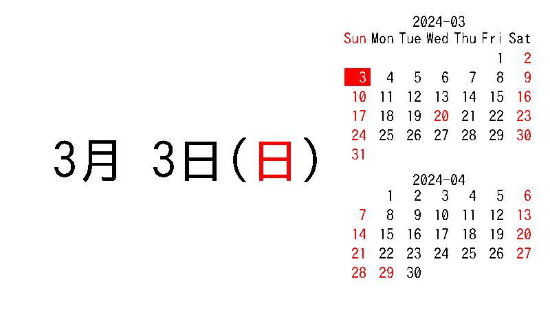

# Calendar image server for e-Paper

電子ペーパー用にカレンダー画像を生成するサーバです。

(クライアント： https://github.com/binzume/esp32-epaper)

HTTPでアクセスすすると今月のカレンダーと今日の日付が入ったGIF画像を生成します。

リクエスト時のファイル名を、 `YYYY-MM-DD.gif` とすると指定した日付の画像を返します。

ttfフォントはIPAフォントなどを適当に用意してください。

holiday.csv は https://www8.cao.go.jp/chosei/shukujitsu/gaiyou.html からダウンロードしたものから必要な範囲を抜き出して作っています。

例：

# License

MIT License
